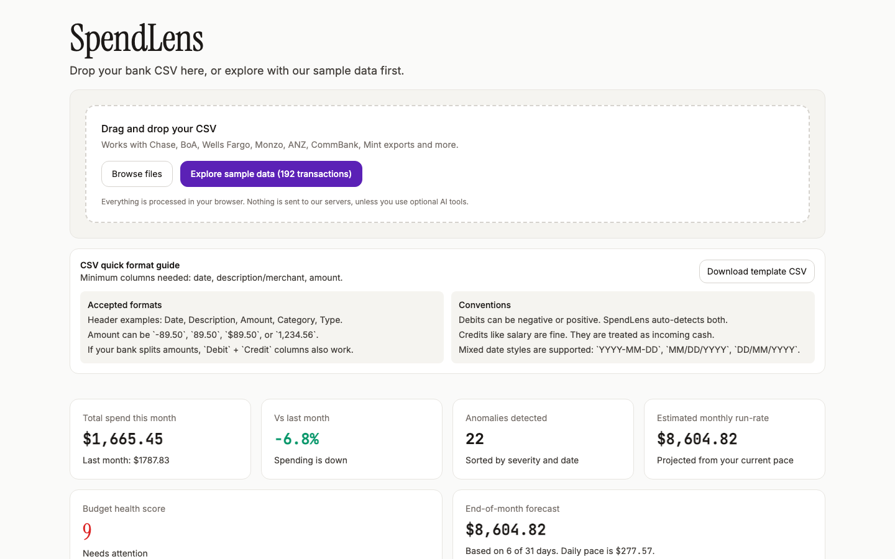
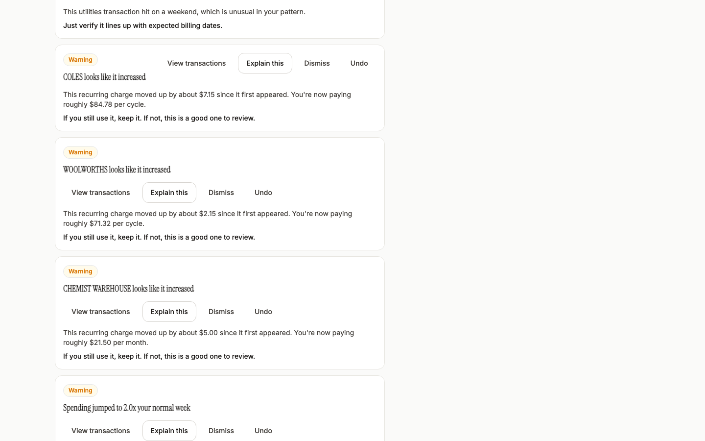
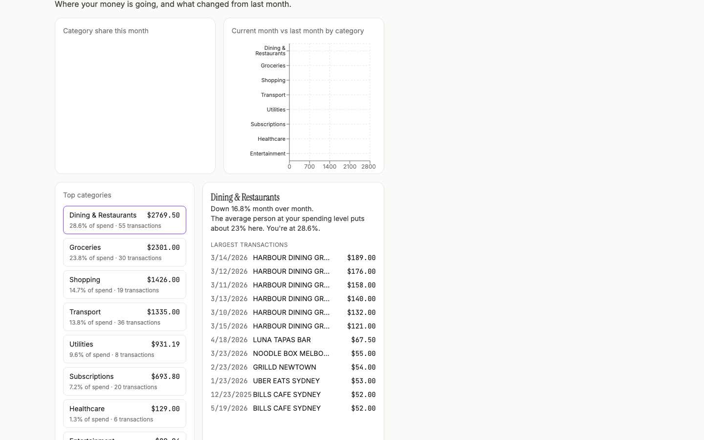

# SpendLens — See Where Your Money Actually Goes

SpendLens is a personal finance anomaly detector.
Drop in a CSV from your bank and it shows what changed, what looks weird, where your money is going, and what to check next.

No sign-up. No bank linking. No account setup.

## Why this exists
Most personal finance apps still put friction before value.

As of **May 6, 2026**, the quick market scan looked like this:

- **Mint**: shut down and moved users toward Credit Karma.
- **YNAB**: powerful, but paid (`$109 USD/year` or `$14.99/month`).
- **Cleo**: very chat-first; UK docs currently show a reduced UK feature set and no international bank support outside the UK.
- **Copilot Money**: available in the US and US territories only.
- **Emma**: free tier + paid tiers, with documentation focused on UK/US/Canada.
- **Snoop**: UK-focused product and UK financial context.

That left a gap for a simple “drop CSV, get answers in seconds” workflow.

### Research links
- Mint discussion + migration references: https://ttlc.intuit.com/community/other-financial-discussions/discussion/what-are-you-moving-to-now-that-mint-is-shutting-down/00/3106588
- YNAB pricing: https://www.ynab.com/pricing
- Cleo UK availability: https://web.meetcleo.com/faqs/en/articles/12992410-what-s-available-in-the-uk-app
- Cleo UK limits: https://web.meetcleo.com/faqs/en/articles/12641377-what-can-t-cleo-do-uk
- Copilot region availability: https://help.copilot.money/en/articles/11780342-copilot-money-for-web
- Emma pricing/add-ons: https://help.emma-app.com/en-us/article/1t6jgpo/
- Emma country availability mention: https://help.emma-app.com/en-us/article/e6en6g/
- Snoop UK context: https://snoop.app/snoop-hq/
- Snoop UK address requirement: https://snoop.app/card-eligibility/

## What SpendLens does

- Catches anomalies: duplicate charges, spending spikes, unusual timing, subscription increases, category drift, and first-time high-value merchants
- Shows a clean category and merchant breakdown
- Tracks recurring charges and annual subscription cost
- Gives a month-over-month trend and spend forecast
- Lets you search/filter/export transactions
- Adds optional AI explanations and what-if simulations with Gemini 2.0 Flash

## CSV format guide

Your CSV needs at least these columns:

- `Date`
- `Description` (or merchant/payee text)
- `Amount`

Optional but useful:

- `Category`
- `Type` (`debit` or `credit`)
- split `Debit` + `Credit` columns

Accepted amount styles:

- `-89.50`
- `89.50`
- `$89.50`
- `1,234.56`

Accepted date styles:

- `YYYY-MM-DD`
- `MM/DD/YYYY`
- `DD/MM/YYYY`

Template file:

- [`public/spendlens-template.csv`](/Users/gurshan/Desktop/SpendLess/public/spendlens-template.csv)

## Privacy model
Core detection runs client-side in the browser.

- Your CSV is parsed locally with PapaParse
- Statistical anomaly detection runs in-browser
- No database, no account persistence, no background sync

Optional AI features call `/api/ai` using a server-side `GEMINI_API_KEY`.

## Screenshots


*Overview cards, health score, and the first analysis fold after loading data.*


*Severity-ranked anomalies with plain-English explanations and actions.*


*Category share + current vs previous month comparison.*

## Demo

`/screenshots/demo.webm`

## Run locally

```bash
git clone <your-repo>
cd spendlens
npm install

# Optional for AI features
cp .env.example .env.local
# Add GEMINI_API_KEY in .env.local

npm run dev
# http://localhost:3000
```

## Test commands

```bash
npm test
npm run e2e:screenshots
npm run e2e:mobile
npm run build
```

## Deploy to Vercel

1. Push this repo to GitHub.
2. Import it in Vercel and deploy.
3. Add `GEMINI_API_KEY` in Vercel Project Settings → Environment Variables (optional, only for AI features).

## Tech choices

- **Next.js 14 App Router + TypeScript**
- **Recharts** for category/month trend charts
- **PapaParse** for robust CSV parsing
- **Gemini 2.0 Flash** for optional natural-language helpers
- **Vitest + Testing Library** for unit/component/integration tests
- **Playwright** for screenshot and flow capture

## Notes on architecture

- Core anomaly engine is in [`src/lib/anomaly-detection.ts`](src/lib/anomaly-detection.ts)
- CSV parsing + auto mapping is in [`src/lib/csv-parser.ts`](src/lib/csv-parser.ts)
- Sample data generator is in [`src/lib/sample-data.ts`](src/lib/sample-data.ts)
- AI route is in [`src/app/api/ai/route.ts`](src/app/api/ai/route.ts)
